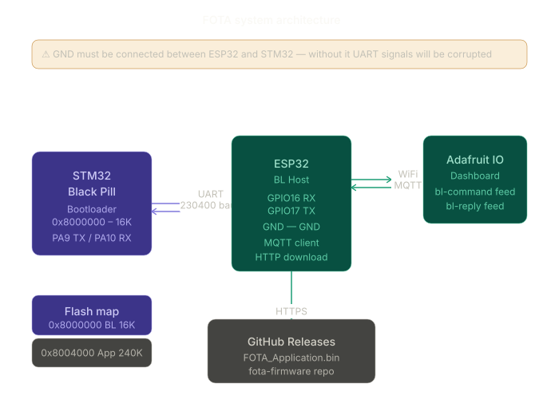

# FOTA — STM32 Black Pill + ESP32

Firmware Over-The-Air (FOTA) update system for STM32 Black Pill (STM32F401CCU6) using ESP32 as a wireless host and Adafruit IO as a cloud dashboard.

---

## Demo Videos

| Video | Description |
|-------|-------------|
| [Video 1](demos/01_bootloader_python_test.mp4) | Bootloader test using Python script over UART |
| [Video 2](demos/02_dashboard_fota_demo.mp4) | Full FOTA demo via Adafruit IO Dashboard |

---

## System Architecture



---

## Repository Structure

```
FOTA-STM32-BlackPill-ESP32/
│
├── src/                        # ESP32 source files
│   ├── main.cpp
│   ├── BL_Host.cpp             # Bootloader command handler
│   ├── mqtt.cpp                # Adafruit IO MQTT
│   ├── Connect_to_Wifi.cpp
│   └── Fire_Base.cpp           # GitHub Release firmware download
│
├── include/                    # ESP32 header files
│   ├── BL_Host.h
│   ├── mqtt.h
│   ├── Connect_to_Wifi.h
│   ├── Fire_Base.h
│   └── secrets.h               # ⚠️ Not included — create manually (see setup)
│
├── STM32_Bootloader/           # STM32 Black Pill firmware
│   ├── APP/
│   │   ├── Bootloader.c
│   │   ├── Bootloader.h
│   │   ├── main.c
│   │   └── main.h
│   ├── MCAL/
│   │   ├── UART/
│   │   ├── GPIO/
│   │   ├── RCC/
│   │   ├── FPEC/               # Flash controller
│   │   ├── CRC/                # Hardware CRC
│   │   ├── NVIC/
│   │   ├── SCB/
│   │   └── SYSTICK/
│   ├── LIB/
│   ├── Startup/
│   ├── STM32F401CCUX_FLASH.ld  # ⚠️ Bootloader linker script
│   ├── BL_Host.py              # Python test script
│   └── uart_test.py
│
├── demos/
│   ├── 01_bootloader_python_test.mp4
│   └── 02_dashboard_fota_demo.mp4
│
├── platformio.ini
└── .gitignore
```

---

## Bootloader Protocol

| Command | Code | Description |
|---------|------|-------------|
| `CBL_GET_VER_CMD` | `0x10` | Get bootloader version |
| `CBL_GET_CID_CMD` | `0x12` | Get chip ID |
| `CBL_GET_RDP_STATUS_CMD` | `0x13` | Read protection level |
| `CBL_FLASH_ERASE_CMD` | `0x15` | Erase application flash |
| `CBL_MEM_WRITE_CMD` | `0x16` | Write firmware to flash |
| `CBL_GO_TO_MAIN_APP_CMD` | `0x18` | Jump to application |

ACK: `0xCD` — NACK: `0xAB`

---

## ⚠️ Critical: Linker Script Configuration

The bootloader and application must use different memory regions.

### Bootloader — `STM32_Bootloader/STM32F401CCUX_FLASH.ld`

```
MEMORY
{
  RAM    (xrw) : ORIGIN = 0x20000000, LENGTH = 64K
  FLASH  (rx)  : ORIGIN = 0x8000000,  LENGTH = 16K
}
```

### Application — any user application

```
MEMORY
{
  RAM    (xrw) : ORIGIN = 0x20000000, LENGTH = 64K
  FLASH  (rx)  : ORIGIN = 0x8004000,  LENGTH = 240K
}
```

⚠️ If your application linker script starts at `0x8000000`, it will overwrite the bootloader and the FOTA system will stop working.

---

## Hardware Wiring

### STM32 Black Pill to ESP32

| STM32 Pin | ESP32 Pin | Description |
|-----------|-----------|-------------|
| PA9 (TX1) | GPIO16 (RX2) | STM32 transmits to ESP32 |
| PA10 (RX1) | GPIO17 (TX2) | STM32 receives from ESP32 |
| GND | GND | ⚠️ Must be connected |

⚠️ GND must always be connected between the two boards. Without a common ground, UART signals will be corrupted.

---

## Setup & Installation

### 1. Clone the repository

```bash
git clone https://github.com/aaref5720/FOTA-STM32-BlackPill-ESP32.git
cd FOTA-STM32-BlackPill-ESP32
```

### 2. Create `include/secrets.h`

This file is not included in the repo. Create it manually:

```cpp
#ifndef SECRETS_H
#define SECRETS_H

#define WIFI_SSID       "your_wifi_ssid"
#define WIFI_PASSWORD   "your_wifi_password"
#define AIO_USERNAME    "your_adafruit_username"
#define AIO_KEY         "your_adafruit_io_key"

#endif
```

Get your Adafruit IO key from [io.adafruit.com](https://io.adafruit.com) under Account > My Key.

### 3. Flash the STM32 Bootloader

Open `STM32_Bootloader/` in STM32CubeIDE and flash using ST-Link.

### 4. Build and flash ESP32

```bash
pio run --target upload
```

### 5. Adafruit IO Dashboard Setup

Create two feeds on [io.adafruit.com](https://io.adafruit.com):

- `bl-command` — receives commands from dashboard buttons
- `bl-reply` — displays bootloader responses

Add buttons to the dashboard:

| Button label | Feed | Press value |
|-------------|------|-------------|
| Upload Application | `bl-command` | `upload` |
| Get BL Version | `bl-command` | `version` |
| Erase Application | `bl-command` | `erase` |
| Get Chip ID | `bl-command` | `cid` |
| Jump To Application | `bl-command` | `jump` |
| Read Protection Level | `bl-command` | `rdp` |

---

## Deploying a New Firmware via GitHub Release

1. Build your application in STM32CubeIDE — make sure the linker script starts at `0x8004000`
2. Find the `.bin` file in your project `Debug/` folder
3. Go to [github.com/aaref5720/fota-firmware](https://github.com/aaref5720/fota-firmware)
4. Click Releases > Draft a new release
5. Create a new tag (e.g. `v1.0.1`) and upload the `.bin` file
6. Update `FIRMWARE_URL` in `include/Fire_Base.h`:

```cpp
#define FIRMWARE_URL "https://github.com/aaref5720/fota-firmware/releases/download/v1.0.1/FOTA_Application.bin"
```

7. Re-flash the ESP32

---

## Testing with Python Script

Test the bootloader directly from your PC:

```bash
cd STM32_Bootloader/
pip install pyserial
python3 BL_Host.py
```

Make sure the STM32 is connected via USB-to-TTL (CH340 or similar) and the correct port is set in the script.

---

## Dependencies

### ESP32 (PlatformIO)

- `Adafruit MQTT Library @ ^2.6.4`
- `WiFi.h` — built-in with ESP32 Arduino framework
- `HTTPClient.h` — built-in
- `Update.h` — built-in

### Python test script

```bash
pip install pyserial
```

---

## Author

Abdelrahman Mohamed — Embedded Systems Engineer

---

## License

This project is open source and available under the [MIT License](LICENSE).
